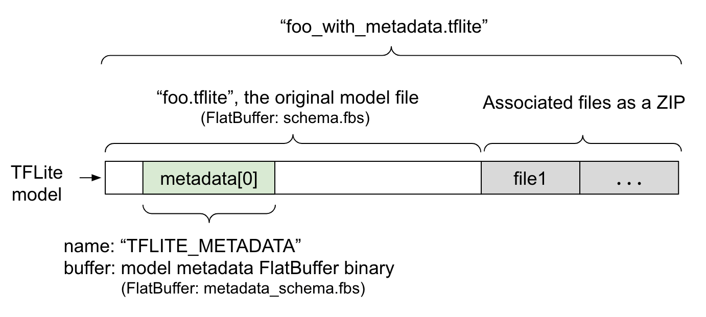

# Metadata Extraction

Some tflite models may come with associated files, such as classification label files.
This tool extracts those files.



* For other [metadata](https://www.tensorflow.org/lite/models/convert/metadata) details use: https://github.com/lutzroeder/netron

## Usage

Download the example file and then you can extract data like this:

```
shards build
./bin/metadata_extract -t ./lite-model_ssd_mobilenet_v1_1_metadata_2.tflite
```

## Example file

https://tfhub.dev/tensorflow/lite-model/ssd_mobilenet_v1/1/metadata/2
